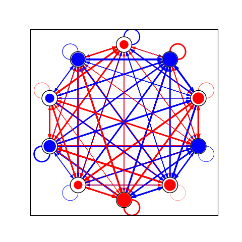

This is a Standard ANN library.

**Activation Function**


Possible activation functions:
- Linear: identity, except that it truncates values to lie in [-1, 1]
- Sine: calculates the sine-wave f(x) = sin(x)
- Gaussian: calculates a gaussian f(x) = e^(-x*x), scaled to lie in [-1, 1]
- Sigmoid: calculates the sigmoid f(x)=tanh(x*lambda)

**Testing the Library**

```console
g++ main.cpp -o ANN
```

```console
./ANN [number_of_neurons]
```

**Visualizing the Neural Network**

```console
python plotANN.py std_ANN.csv
```

<p align="center">
  
</p>
